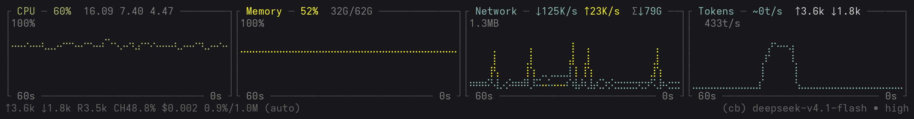
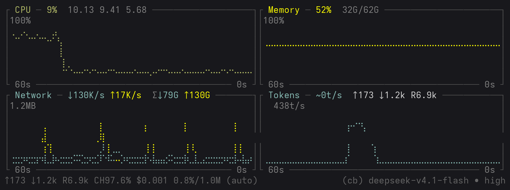

<div align="center">

# pi-sysmon

**在 [pi](https://github.com/earendil-works/pi) 里显示 bottom 风格的 braille 折线图**

CPU · 内存 · 网络 · Tokens —— 用盲文点阵字符画的实时历史曲线

[](#测试)
[](LICENSE)



<sub>150 列宽下的默认四图。曲线由盲文字符绘制，y 刻度叠印在绘图区内侧、
时间标签嵌在下边框里。</sub>

</div>

```
┌ CPU ─ 8%  3.45 3.61 2.85 ──────────┐┌ Memory ─ 53%  33G/62G ─────────────┐┌ Network ─ ↓23K/s ↑3.4K/s  Σ↓79G ──┐┌ Tokens ─ ~58t/s  ↑5.9k ↓60 R2.7k ─┐
│100%                                ││100%                                ││1.0MB                              ││ 1.6Kt/s                           │
│                                    ││                                    ││                                   ││                                   │
│                                    ││⣀⣀⣀⣀⣀⣀⣀⣀⣀⣀⣀⣀⣀⣀⣀⣀⣀⣀⣀⣀⣀⣀⣀⣀⣀⣀⣀⣀⣀⣀⣀⣀⣀⣀⣀⣀││                                  ⢸││  ⡇     ⢰     ⢠      ⡆     ⢸      ⡆│
│                                    ││                                    ││                                  ⢸││ ⢠⢇     ⣿     ⢸⡄    ⢀⡇     ⡼⡀    ⢀⡇│
│ ⢀⡀ ⢀         ⡀    ⢀ ⡀  ⡀     ⢀  ⡀ ⡀││                                    ││                                  ⡇││ ⢸⢸    ⢠⠃⡇    ⡇⡇    ⢸⢸     ⡇⡇    ⢸⢸│
│⠒⠁⠑⢦⠋⠒⠊⠑⢦⠒⠲⡔⠒⠚⠑⠒⠒⠲⡔⠙⡜⢣⠔⢶⢣⠴⡔⠒⠒⠒⠃⠑⠊⢣⠜⠑││                                    ││⣀⣀⣀⣀⣀⣀⣀⣀⣀⣀⣀⣀⣀⣀⣀⣀⣀⣀⣀⣀⣀⣀⣀⣀⣀⣀⣀⣀⣀⣀⣀⣀⣀⣀⣇││⠉⠉⠈⠉⠉⠑⠒⠚ ⠣⠤⠤⠤⠤⠇⠸⠤⠤⠤⠤⠜⠘⠒⠒⠊⠉⠉⠁⠉⠉⠉⠒⠒⠚⠘│
└ 60s ─────────────────────────── 0s ┘└ 60s ─────────────────────────── 0s ┘└ 60s ────────────────────────── 0s ┘└ 60s ────────────────────────── 0s ┘
```

## 特性

- **真正的折线图**，不是进度条或 sparkline —— 每个字符编码 2×4 个盲文点子像素，等效把终端分辨率放大 8 倍
- **零依赖** —— 只用 Node 内置模块 + pi 的公开扩展 API
- **直接读 `/proc`** —— 不需要 `systeminformation` / `pidusage` 之类的包
- **默认四图** —— CPU / 内存 / 网络 / **Tokens（LLM 吞吐速率）**；
  Tokens 图实时显示本 pi 进程与模型 API 之间的输出 token 速率，
  并与 pi 自身在状态栏显示的 `⚡ 23.0 t/s (avg)` 相互印证
- **带坐标轴** —— y 轴刻度、x 轴线、时间窗标签，复刻 bottom 的排版
- **y 轴顶端 = 整窗真实最高值** —— 60s 窗口内任何一处的高度都能直接用顶端刻度读出来，
  刻度绝不撒谎（配合 `PI_SYSMON_SCALE_WINDOW=<1` 还能开启尖峰后自动回落）
- **自动剔除本机环回/容器流量** —— `lo` / `veth*` / `docker*` / `br-*` 不计入网速
  （实测：本机推 30 MB/s 环回流量时，网速图只报物理网卡的 178 KB/s）
- **响应式并排** —— 终端宽时四张图并排一行，变窄自动降级成 2×2 / 1 列竖排，不会把曲线挤成噪声
- **Tokens 图分上下行** —— 读数与 pi 自己的状态栏同口径（`↑` 上行 input / `↓` 下行 output /
  `R` 缓存读），两边数字可以直接对照；上行是**精确值**，速率是估算值（带 `~`）
- **图表利用率高** —— 刻度叠在绘图区内侧、时间标签嵌进边框。**同样的块高**下
  绘图面积比「刻度独占列 + 轴线独占行」的旧排版大 **~71%**
  （50 列宽、8 行高：168 格 → 288 格）
- **读数写在边框标题栏里**（默认）—— 复用那行本来就有的 `─` 填充，零成本、不遮曲线；也可用 `PI_SYSMON_LABEL=box` 换回 bottom 的右上角浮框
- **状态持久化** —— 开关和模式记在配置文件里，重启保留
- **多种显示模式** —— 图表（默认）/ 一行文字 / 整块底部
- **纯 Linux 友好，其他平台不崩** —— 非 Linux 上采集自动退化为零值

## 截图

四张图各自的读数都写在**边框标题栏**里（复用那行本来就有的 `─` 填充，
不遮任何曲线）。y 轴刻度**叠印在绘图区内侧**、时间标签**嵌在下边框里**。

这两处省下的空间是可量化的。**按同样的块高（8 行）、块宽 50 列比**：

| 排版 | 每块 chrome | 绘图区 |
| --- | --- | --- |
| 旧（刻度独占 5 列 + 轴线独占 1 行） | 4 行 | 42 × 4 = 168 |
| 现在（叠印 + 边框兼任轴） | 2 行 | 48 × 6 = 288 |

增益拆开是两个因数相乘：宽度 42 → 48（**+14%**，刻度不再占列）×
行数 4 → 6（**+50%**，省下的两行还给数据）≈ **+71%**。

### 窄终端自动降级（95 列）



终端变窄时排成 2×2，再窄就变 1 列竖排。断点在 96 列：
≥ 96 是四图并排一行（上方那张），< 96 就降到 2×2（这张是 95 列）。
bottom 在同样宽度下会把四张图硬挤成一行（每张 16 列左右），曲线就不可读了。

### Tokens 图的上下行

```
┌ Tokens ─ ~58t/s  ↑5.9k ↓60 R2.7k ─┐
```

读数与 pi 自己的状态栏同口径（`↑` 上行 input / `↓` 下行 output / `R` 缓存读），
所以两边可以直接对照。几个细节：

- **曲线只画下行速率**。两个方向的时间形状完全不同（上行是一次性整块上传、
  下行是逐字流式，实测比例约 516:1），画同一根轴上会将下行压成 0.2% 高度。
- **`~` 只加在速率上** —— 它是从流式增量估算的；累计值来自 provider 的
  精确 `usage`，所以不带 `~`。哪个数字可信，一眼能看出来。
- 块变窄时按重要度逐段丢弃：速率 → 上行 → 下行 → 缓存读。

## 安装

### 单文件（推荐，最简单）

```bash
npm run build:single    # 生成 dist/pi-sysmon.ts
cp dist/pi-sysmon.ts ~/.pi/agent/extensions/pi-sysmon.ts
```

重启 pi 即可看到曲线，**默认就是开启的**。

### 目录形式（多文件）

```bash
cp -r . ~/.pi/agent/extensions/pi-sysmon
```

> ⚠️ 目录形式**必须放在子目录里**。pi 的自动发现会把 `extensions/` 下的每个 `.ts`
> 都当成扩展加载，平铺多个文件会导致 `braille.ts` 被当作扩展而整个加载失败。

### 从 npm / git 安装

```bash
pi install git:github.com/zzjcool/pi-sysmon
```

## 使用

```text
/sysmon                开 / 关（会持久化）
/sysmon on | off       显式开 / 关
/sysmon chart          图表模式（默认）
/sysmon below|above    图表 / line 放编辑器下方（默认）/ 上方（持久化）
/sysmon line           一行文字模式（下方那条 `CPU … TOK …`）
/sysmon footer         用图表替换整个底部（可以比 widget 模式更高）
```

`chart` / `line` 是**互斥的显示模式**（点某个模式名 = 切过去并打开，不会把监控关掉）；
`on` / `off` / `above` / `below` 与模式正交。

### line 模式显示什么

一行、按重要度降序、放不下时从**尾部整段**丢弃（不会切出 `↑1.0` 这种半截数字）：

```text
CPU 12%  MEM 60% 37G  NET ↑592K/s ↓34K/s  TOK ~0t/s ↑5.7k ↓89 R2.7k
└─ 系统指标 ─────────────────────────┘ └─ LLM token ──────────────────┘
```

- **CPU / MEM / NET** 与图表模式的对应块同源、同配色；
- **TOK** 是 LLM token 吞吐：`~<速率>`（由流式 delta 估算，所以带 `~`）
  加会话累计的 `↑input ↓output RcacheRead`（来自 `message_end` 的**精确** usage，
  逐字对齐 pi footer 的 `↑↓R` 口径，可以直接和底部那行对照）；
- 无快照（非 Linux / `/proc` 不可读）时仍会输出 TOK 段 —— 它是唯一不依赖 `/proc` 的指标。

`line` 用 **widget** 实现而不是 `setStatus`，所以它和图表一样遵循 `above`/`below`：
`/sysmon below` 后图表与 line 会出现在**同一个位置**。
（`setStatus` 的内容永远被 pi 内建 footer 渲染，位置钉死在底部，改不了。）

图表按终端宽度**响应式**排版（以默认四图为例）：

| 终端宽度 | 布局 |
| --- | --- |
| ≥ 96 列 | 4 张图并排一行（共 8 行） |
| 48 – 95 列 | 2 列 × 2 行 |
| < 48 列 | 1 列竖排 |

> 行数按 widget 模式默认预算计算（`PI_SYSMON_CHART_HEIGHT=6`、`WIDGET_MAX_ROWS=18`）；
> footer 模式预算更大（40 行），行数会更多。

每张图最少需要 24 列（边框 2 + 绘图区 22）。刻度是**叠印**在绘图区上的、
不占独立列，所以这个下限比旧排版（刻度独占 5 列）低不少。
比这更窄时 bottom 会把 N 张图硬挤成一团（50 列时每张只有 16 列，曲线已不可读），
本项目改为降级排列。

列数还会随**块数**自适应（块数由 `PI_SYSMON_TOKENS` / `PI_SYSMON_DISKS` 决定）：
三图时 ≥ 72 列即并排（旧行为不变）；块数 ≥4 时**跳过 3 列档**，避免排成
「3+1」那种第二组只有一个块加一整行空格子的形态。

### 配置

| 环境变量 | 默认 | 说明 |
| --- | --- | --- |
| `PI_SYSMON_INTERVAL` | `1000` | 采样间隔（毫秒，下限 500） |
| `PI_SYSMON_POINTS` | `60` | 历史点数（覆盖 `PI_SYSMON_WINDOW` 换算出的点数） |
| `PI_SYSMON_CHART_HEIGHT` | `6` | 每张图的绘图行数（不含上/下边框那 2 行） |
| `PI_SYSMON_LABEL` | `title` | 读数位置：`title`（边框标题栏）/ `box`（右上角浮框）/ `both` / `none` |
| `PI_SYSMON_WINDOW` | `60` | 横轴时间窗长度（秒） |
| `PI_SYSMON_SCALE_WINDOW` | `1`（= 量程窗 == 显示窗） | 速率图**量程取样比例**：`1` = y 轴顶端为整窗真实最高值；设 `<1`（如 `1/6`）开启「尖峰过去约 10s 后自动回落」（此时超出量程的尖峰会显示为 `+` 标记） |
| `PI_SYSMON_MODE` | `chart` | 初始模式（`chart` / `line` / `footer`） |
| `PI_SYSMON_PLACEMENT` | `belowEditor` | `chart` / `line` 挂在编辑器**下方**（默认）还是**上方**：`belowEditor` / `aboveEditor`（也可用 `/sysmon below` / `/sysmon above` 随时切换，会持久化；`footer` 模式不受影响） |
| `PI_SYSMON_TOKENS` | 开 | LLM token 吞吐图。设 `0` 回到旧的三图形态 |
| `PI_SYSMON_DISKS` | — | 设 `1` 再加一块磁盘 I/O 图（第 5 块） |

开关状态写在 `<configDir>/pi-sysmon.json`（`configDir` 默认 `~/.pi/agent`）。

## 实现说明

图表没有用任何 TUI 绘图库，而是自己合成字符。核心是 **braille 点阵**：

每个 braille 字符（U+2800–U+28FF）对应 8 个可独立点亮的点，排成 2 列 × 4 行：

```
(0,0) (1,0)      bit0  bit3
(0,1) (1,1)  →   bit1  bit4
(0,2) (1,2)      bit2  bit5
(0,3) (1,3)      bit6  bit7
```

所以一个 `width × height` 的字符区域，实际分辨率是 `2*width × 4*height`。
把数据点线性映射到子像素坐标，再用 **Bresenham** 连成线，就能得到平滑的折线。

这与 [bottom](https://github.com/ClementTsang/bottom) 的做法一致（ratatui 的
`Marker::Braille`）。我们对齐了 bottom 的这些参数：

| 项 | bottom | 本项目 |
| --- | --- | --- |
| 绘制字符 | `Marker::Braille`（2×4 子像素） | 同 |
| 连线算法 | Bresenham | 同 |
| 百分比图 y 轴 | 固定 `0 .. 100.5` | 同 |
| 动态图 y 轴 | 窗口内最大值 × 1.5（留白） | 同 |
| 网格线 | 无，只有轴线 + y 刻度 + 两端时间标签 | 同 |
| 默认采样间隔 | 1000 ms | 同 |
| 每张图 | `Block` 边框，标题嵌在上边框里 | 同 |
| y 刻度位置 | 独立列（占 5 列宽） | **叠印在绘图区内侧**（不占列） |
| y 刻度数量 | 百分比 2 个、速率 4 个 | **只标顶端 1 个**（带单位） |
| x 时间标签 | 单独占一行 | **嵌在下边框里**（省 1 行） |
| x 轴线 | 单独占一行 | 由 0 基线兼任（省 1 行） |
| 右上角读数框 | 覆盖画在绘图区右上角，空间不够就整块消失 | 同（阈值算法不同，见下） |
| 宽度不够时 | 把 N 张图硬挤到一行（50 列时每张 16 列） | **降级成 2 列 / 1 列** |
| 横轴默认窗口 | 60 s | 同 |
| 自动量程回落 | 滞后计数后降档（`net_auto`） | 默认**不回落**（顶端 = 整窗最高值）；可选 `PI_SYSMON_SCALE_WINDOW=1/6` 开启 |

### 架构

```
src/
├── metrics.ts      # 采集层：读 /proc/{stat,meminfo,net/dev,diskstats} + os.loadavg
├── braille.ts      # 渲染层：数据 → braille 点阵 → 字符行（纯函数，无副作用）
├── tokens.ts       # 估算层：LLM 流式增量 → token 数（纯函数 + 闭包 meter）
├── blocks.ts       # 组装层：历史 + 快照 → MetricBlock[]（纯数据 → 纯数据）
├── chart-panel.ts  # 布局层：响应式列数、边框、刻度、浮动读数框、并排拼接
└── index.ts        # 扩展层：pi 生命周期、命令、配置持久化、定时刷新
```

依赖方向单向：`index → {chart-panel, blocks, metrics}`，`blocks → chart-panel`，
`chart-panel → braille`、`blocks → tokens`。`braille.ts` 与 `tokens.ts`
**不依赖任何其它本模块**。

分层原则：`braille.ts` 是**纯函数**（输入数值数组，输出字符串数组），因此可以脱离
pi 单独测试与复用；`metrics.ts` 只负责读数，不关心怎么显示。

### 与 bottom 的排版是怎么对齐的

不是靠肉眼调参数，而是读 bottom/ratatui 的源码把算法抄准，再用受控宽度的真实
`btm` 抓帧逐字符核对（`┌ CPU ─ 1.91 1.80 2.17 ───┐` 那种）。
例如：

- **x 轴线不延伸到 y 轴那一列** —— ratatui 的 `Chart::layout` 在放下 y 轴后执行了 `x += 1`；
- **左下时间标签的末位落在 y 轴列上** —— `labels_alignment = Left` 时首个 x 标签的区域是
  `[chart_left, graph_left)`（左含右不含）再右对齐；
- **y 刻度位置** 用 `dy = i * (plotH - 1) / (n - 1)`（索引 0 在**底部**）。

**三处有意偏离**：

1. **读数默认写在边框标题栏里**（`PI_SYSMON_LABEL=title`），而不是 bottom 的右上角浮框。
   标题栏那一行本来就要写块名，剩下的 `─` 填充是**纯装饰** —— 拿来放读数零成本，
   且不遮任何曲线。bottom 的浮框是覆盖画在绘图区右上角的，会真的吃掉一块绘图区。
   想换回 bottom 那种浮框就设 `PI_SYSMON_LABEL=box`。

2. **浮框显隐阈值**（仅在 `box`/`both` 模式生效）。bottom 用 `hidden_legend_constraints`
   这套**按比例**的阈值（Network 是 9/10 × 3/4），但它是按 40+ 列宽的图校准的，
   套到本项目 20~30 列的块上会导致读数框永远不显示。
   本项目改成「放得下（`legendW <= plotW`）且浮框下面还留得出一行曲线（`legendH < rows`）」——
   后者是为了避免浮框下边框与绘图区底部的 0% 基线叠成一条双横线。

3. **读数是分级片段**，块窄时从尾部逐段丢弃。比如 Network 的顺序是
   `瞬时速率 → 累计流量`，窄块下先丢累计流量，保住更重要的瞬时速率。

## 测试

```bash
npm test          # 102 项单元测试（braille 13 + layout 66 + tokens 23）
```

```bash
npm run typecheck # tsc strict
npm run check     # 两者都跑
```

`test/braille.test.ts` 覆盖 braille 位映射（对照 Unicode 标准逐点验证）、坐标映射、
输出尺寸、边界输入（空数据 / 全零 / 单点 / `NaN` / `Infinity` / 极小宽度）。

`test/layout.test.ts` 覆盖响应式布局（列数断点、列宽之和恒等于总宽、行数恒定）
以及**两条会让 pi 崩掉/错位的硬约束**：对 8..220 列全宽度 × 多个高度与块数组合，
断言每行可见宽度不越界、行数与布局声明一致 —— 这两条是扫全宽度而不是抽查几个宽度。

`line` 模式也在这里扫全宽度：`plainLineSegs` + `renderStyledLine` 在 8..220 列下
渲染宽度必须**恰好等于**声明宽度（多一列就 pi 退出），且窄到 1 列也不抛异常、
CPU 段永远保留。

`test/tokens.test.ts` 覆盖 token 估算（英文 `chars/4`、CJK 逐字、emoji 算一个、
非字符串防御）、每秒桶的排空语义（关闭期积压不得变成假尖峰），
以及 `fmtTps` / `tokenAxis` 的**宽度上界**（标题栏读数越界会让 pi 退出）。

### 验证方法：真机抓帧才是唯一可信的

单元测试能捉住几何与坏值，但捉不住**打包/加载**类问题 ——
例如扩展在真实 pi 里根本没被加载、或 bundle 残留相对 import。
本项目用 `pty` 启动真实 pi、用 `pyte` 回放屏幕来验证，
这一步捉到过多次「单测全绿但真机不显示」的事故。

## 开发时踩过的坑

这些是实际踩到并修复的，记下来避免重犯：

1. **宽度算错会让 pi 直接崩溃退出。** pi 的渲染器发现某行超过终端宽度会抛
   `uncaughtException` 并退出。自定义组件必须用 `truncateToWidth()` 截断，
   且不能用 `String.slice()`（它按字节算，会把 ANSI 转义也算进去）。
2. **面板高度变化会挪动编辑器，破坏鼠标选区。** 若组件在有/无数据时行数不同，
   编辑器会上下位移，导致「选中文字后复制不了」。所以高度必须恒定，
   无数据时也要占满同样的行数。
3. **多文件平铺安装会让 pi 启动失败。** 见上文安装说明。
4. **`yMax <= 0` 或数据含 `NaN` 会算出 `NaN` 坐标**，非空断言 `!` 会掩盖这个
   问题并在运行时崩溃。所有坐标都要做有限性检查。
5. **不同扩展的 `setStatus` 共享同一行**，窄终端上会互相挤压截断。

## 贡献

欢迎 issue 和 PR。跑 `npm run check` 确保测试与类型检查通过。

## 致谢

**本项目受 [bottom](https://github.com/ClementTsang/bottom)（`btm`）启发。**

pi-sysmon 最初的想法就是「把 btm 那种终端里的 braille 折线图搬进 pi」。
不只是视觉上的致敬 —— 本项目把 bottom 当作**行为基准**，去读它的源码、
用受控宽度抓它的帧，逐字符核对排版：

- 盲文点阵（`Marker::Braille`，2×4 子像素）与 Bresenham 连线
- 百分比图固定 `0 .. 100.5`、动态图取窗口最大值 × 1.5 的留白
- y 刻度位置 `dy = i * (plotH - 1) / (n - 1)`（索引 0 在底部）
- x 轴线不延伸到 y 轴那一列（ratatui `Chart::layout` 的 `x += 1`）
- 左下时间标签的末位落在 y 轴列上（`labels_alignment = Left` 的半开区间再右对齐）

也正因为它是个成熟工具，我们才看得出**哪里不该照抄** ——
比如本项目把读数放进边框标题栏（bottom 是画在右上角浮框，会吃掉一块绘图区），
以及宽度不够时选择降级排列而不是把 N 张图硬挤成 16 列。
这些偏离都在上文「与 bottom 的排版是怎么对齐的」里逐条记了原因。

感谢 [Clement Tsang](https://github.com/ClementTsang) 和 bottom 的贡献者们。

本项目的另一个前提是 [pi](https://github.com/earendil-works/pi) 提供的扩展 API ——
`setWidget` 的 `placement`、`message_update` 的流式事件、`Theme` 取色，
没有这些就没有这个扩展。

## 许可证

[MIT](LICENSE) —— 随便用。

本项目的**灵感与排版算法参照**来自 bottom（MIT 许可），但**没有复制它的代码**：
所有实现都是按它的可观察行为重写的。
